<div align="center">


# 🕒 Klokk

**Every digit on the wall is drawn by dozens of tiny analog clock hands.**

[](https://kotlinlang.org)
[](https://www.jetbrains.com/compose-multiplatform/)
[](#-build--run)
[](LICENSE)

<table>
  <tr>
    <td>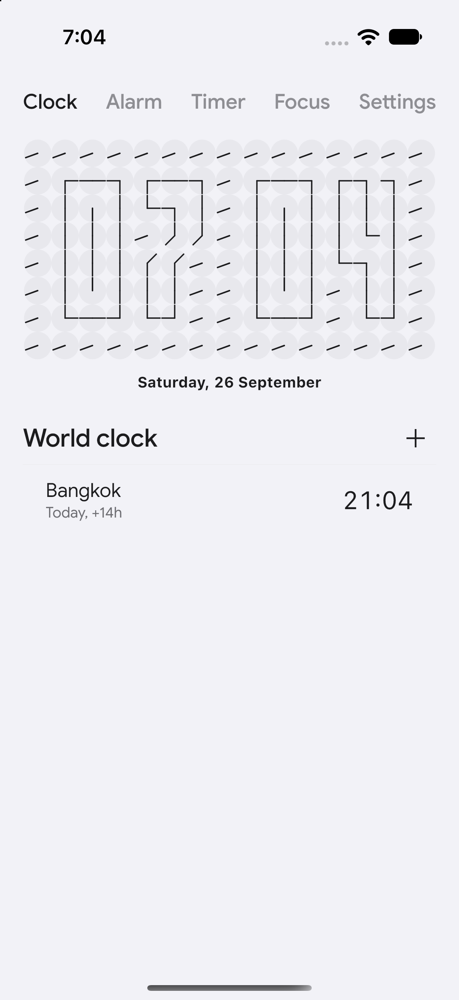</td>
    <td>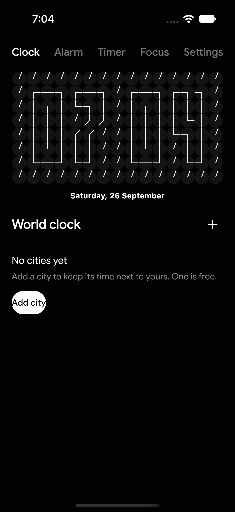</td>
  </tr>
  <tr>
    <td align="center">Clock · light</td>
    <td align="center">Clock · dark</td>
  </tr>
</table>

*All screenshots captured on iPhone (iOS Simulator).*

</div>

Klokk is a kinetic wall clock app: a grid of tiny analog clocks animates in
sync to form digits, waves, ripples and flowers — wrapped in a complete
five-tab clock app (world clock, alarms, timer, focus sessions, settings)
built with **Compose Multiplatform**.

## 📖 Contents

- [Origin](#-origin)
- [Features](#-features)
- [Screenshots](#-screenshots)
- [Demo](#-demo)
- [How the clock grid works](#-how-the-clock-grid-works)
- [Architecture](#-architecture)
- [Tech stack](#-tech-stack)
- [Build & run](#-build--run)
- [Project structure](#-project-structure)
- [Localization](#-localization)
- [Roadmap](#-roadmap)
- [Contributing](#-contributing)
- [Credits](#-credits)
- [License](#-license)

## 🌱 Origin

This project began as a fork of
[theapache64/klokk](https://github.com/theapache64/klokk) — a Compose Desktop
experiment recreating the *Humans since 1982* kinetic art clock. It has since
been rebuilt into a standalone product that far exceeds the original scope, so
the repository now lives **outside the GitHub fork network** as its own
project.

| | upstream (theapache64/klokk) | this repo |
|---|---|---|
| Platforms | Desktop (JVM) | **iOS, Android, Desktop** |
| Scope | kinetic clock-face demo | full clock app — 5 tabs, alarms, timer, focus, paywall, i18n |
| UI | dark demo grid | iOS-style design system, light/dark themes, sheets & overlays |
| State | `ClockData` per cell | `KlokkState` (alarms, cities, timer, focus, Plus, theme) |

## ✨ Features

- **Clock** — live hero grid rendering the current time as clock-hand digits,
  date caption, world-clock city list with search & add sheet, swipe-to-delete
- **Alarm** — alarms with repeat-day chips and labels, on/off toggles, a
  scrub-to-edit hero grid (drag left half = hours, right half = minutes),
  snooze (+9 min on ring tap), swipe-up ring dismissal, FIFO queue for
  concurrent rings
- **Timer** — scrubbable countdown hero, 1/5/10/25-min presets, live progress
  ring, ring overlay on expiry
- **Focus** — focus sessions with an ambient countdown grid and a
  tap-to-reveal End control; sessions logged per day
- **Settings** — appearance picker (Auto / Light / Dark), screensaver show
  picker (Shuffle / Ripple / Trance / Wave) with live preview, widget
  previews, automatic night dimming
- **Klokk Plus** — paywall gating for extra cities, screensavers and widgets;
  three plans (yearly / monthly / lifetime), mock purchase flow, gated actions
  resume automatically after unlock
- **Localization** — English and Vietnamese via Compose Resources
- **Status bar** — light/dark content follows the app theme on iOS

## 📱 Screenshots

| Alarm | Timer | Focus |
|---|---|---|
| 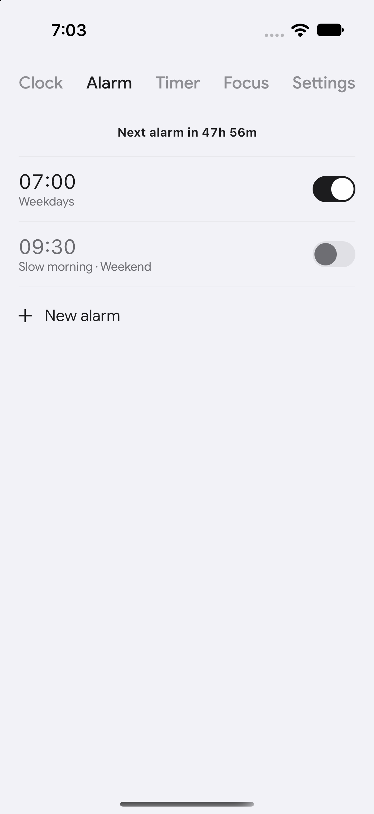 | 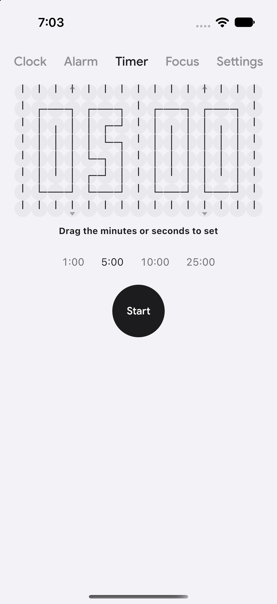 | 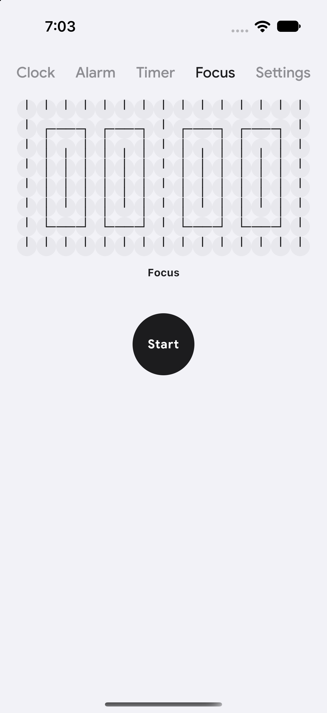 |

| Add city | Settings | Klokk Plus |
|---|---|---|
| 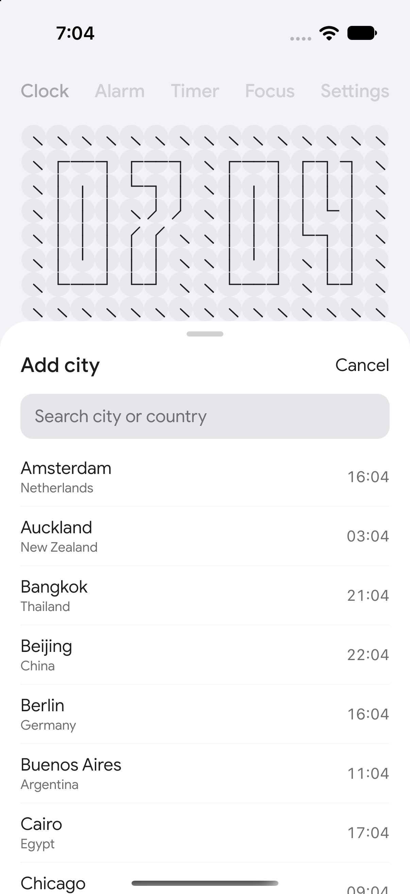 | 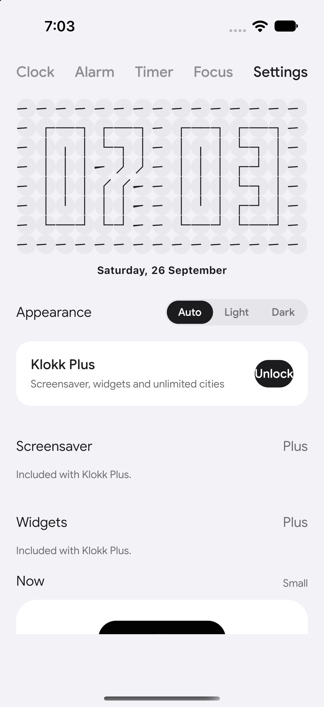 | 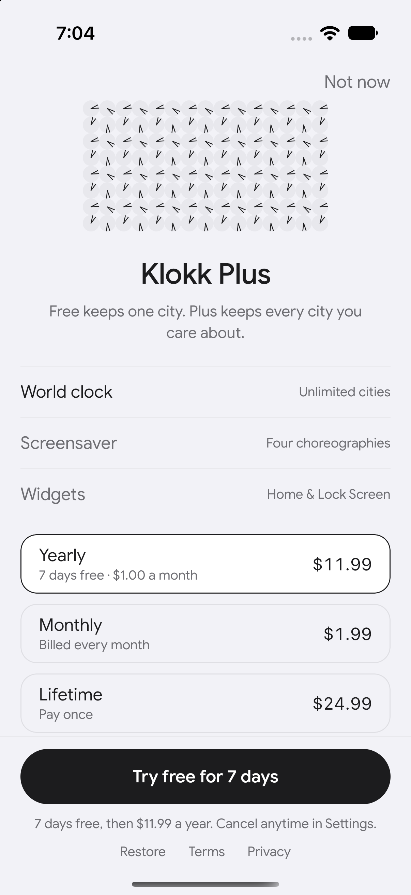 |

## 🔮 Demo

The original desktop kinetic grid in motion:

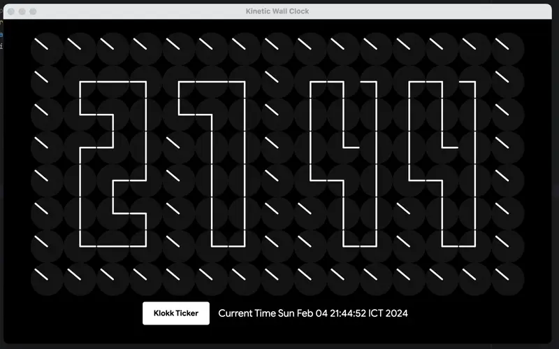

## ⚙️ How the clock grid works

Each cell of the grid is a tiny two-hand clock. A `Movement` (time display,
ripple, trance, wave, text, stand-by) produces a `MatrixGenerator`, which
converts the movement into a `List<List<KlokkCell>>` — target angles, tween
duration and rotation mode per cell. `KlokkGrid` renders the matrix on a
Compose `Canvas`, animating every hand with `Animatable` + `sin`/`cos`
projection.

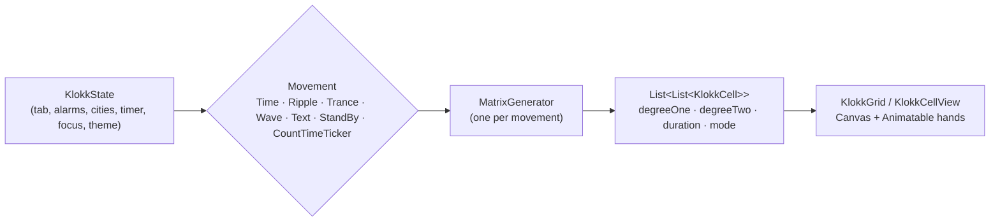

## 🏗 Architecture

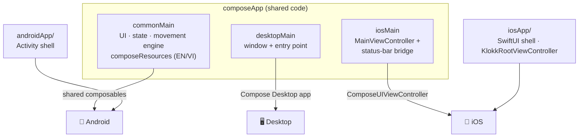

## 🧰 Tech stack

| Layer | Choice |
|---|---|
| Language | Kotlin `2.4.20` |
| UI | Compose Multiplatform `1.12.0` (Material + Foundation) |
| Async | kotlinx-coroutines `1.11.0` |
| Time | kotlinx-datetime `0.8.0` |
| Android | AGP `9.4.0` (`androidMultiplatformLibrary`), minSdk 24 |
| iOS | `iosArm64` + `iosSimulatorArm64` static framework, SwiftUI shell |
| Desktop | Compose Desktop JVM target (`jvm("desktop")`) |
| i18n | Compose Resources (`values`, `values-vi`) |

## 🏃 Build & run

Prerequisites: JDK 17+, and per platform — Android SDK (`androidApp`) or Xcode
on macOS (`iosApp`).

- **Desktop**: `./gradlew :composeApp:run`
- **Android**: `./gradlew :androidApp:installDebug` with an emulator/device
  connected
- **iOS**: open `iosApp/iosApp.xcodeproj` in Xcode on macOS and run
  (`iosArm64`/`iosSimulatorArm64` targets are enabled only on macOS hosts),
  or headless: `xcodebuild -project iosApp/iosApp.xcodeproj -scheme iosApp
  -destination 'platform=iOS Simulator,name=iPhone 17' build`, then
  `xcrun simctl install booted <Klokk.app>` / `xcrun simctl launch booted
  com.theapache64.klokk`

## 📂 Project structure

```
composeApp/                  shared Compose Multiplatform module
  src/commonMain/            all five tabs, overlays, sheets, state,
                             the movement engine, theme, EN/VI strings
  src/desktopMain/           desktop window + main()
  src/iosMain/               MainViewController + KlokkSystemBarStyle (iOS actual)
androidApp/                  Android app shell (Activity + resources)
iosApp/                      Xcode project + SwiftUI shell
                             (KlokkRootViewController drives status-bar style)
extra/                       reference screenshots of the original movements
screenshots/                 iOS app captures used above
```

Key types: `KlokkState` (single source of truth), `Movement` (sealed class of
choreographies), `MatrixGenerator` (movement → cell matrix), `KlokkGrid` /
`Clock` (rendering), `KlokkFormat` / `KlokkStrings` (display helpers).

## 🌐 Localization

Strings live in `composeApp/src/commonMain/composeResources/` — `values/` for
English, `values-vi/` for Vietnamese. The app follows the platform locale.

## ☑️ Roadmap

- [ ] Persist alarms, cities and Plus unlock across launches
- [ ] Real billing integration for Klokk Plus
- [ ] iOS/Android home-screen widgets (previews exist in Settings)
- [ ] Tornado movement
- [ ] Background music
- [ ] More alphabets for the Text movement
- [x] Dark/light theme support
- [x] Second-movement border clocks
- [x] iOS & Android targets

## 🤝 Contributing

Contributions are what make the open source community such an amazing place
to learn, inspire, and create. Any contributions you make are **greatly
appreciated**.

1. Open an issue first to discuss what you would like to change.
2. Fork the project.
3. Create your feature branch (`git checkout -b feature/amazing-feature`).
4. Commit your changes (`git commit -m 'Add some amazing feature'`).
5. Push to the branch (`git push origin feature/amazing-feature`).
6. Open a pull request.

Please make sure to update tests as appropriate.

## ✍️ Credits

Maintained by **Dan Tech** as an independent project.

Standing on the shoulders of the original desktop klokk by **theapache64**
([@theapache64](https://twitter.com/theapache64)) — and inspired by Nezih
Yılmaz's kinetic countdown timer and the *Humans since 1982* artworks.

## ❤ Show your support

Give a ⭐️ if this project helped you!

## 📝 License

```
Copyright © 2021 - theapache64

Licensed under the Apache License, Version 2.0 (the "License");
you may not use this file except in compliance with the License.
You may obtain a copy of the License at

   http://www.apache.org/licenses/LICENSE-2.0

Unless required by applicable law or agreed to in writing, software
distributed under the License is distributed on an "AS IS" BASIS,
WITHOUT WARRANTIES OR CONDITIONS OF ANY KIND, either express or implied.
See the License for the specific language governing permissions and
limitations under the License.
```
